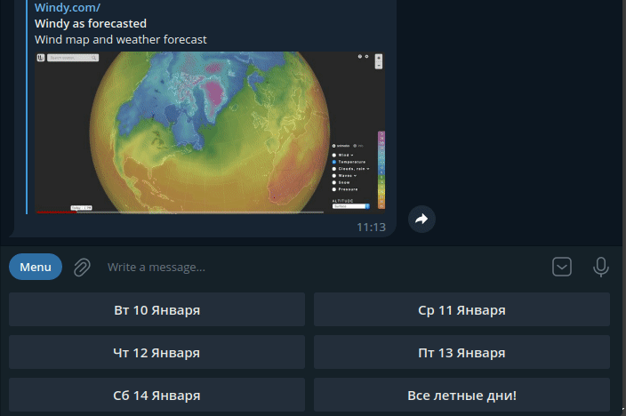
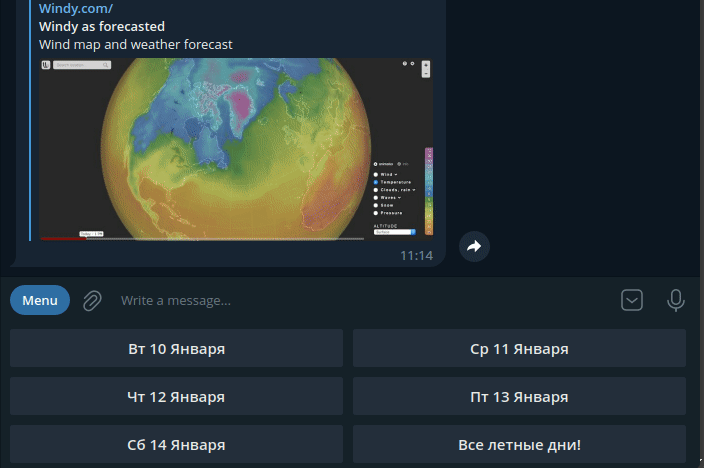

# para_kzn_bot
<b>Позволяет следить за летной погодой в Казани</b>

Ссылка на бот: https://t.me/para_kzn_bot

Стек: framework pyTelegramBotAPI, sqlite3, GitHub, Rest
API.

Данный проект создан для парапланеристов из Казани.
Бот следит за прогнозам погоды и предупреждает когда и где
можно полетать и с какой вероятностью.

## Опписание проекта:

Немного о подкапотной. Раз в сутки cron запускает файл meteo.py,
который делает запрос через Rest API на сайт https://openweathermap.org/api
и записывает прогноз на 5 дней в json файл. Далее cron запускает
файл remainder.py, который анализирует прогноз из файла json и
отправляет всем пользователям из БД, у кого есть нужная отметка
, сформированный, красивый отчет о летных местах. Пользователь
может отказаться или возобновить рассылку с помощью команд /stop
, /go соответсвенно. Также пользователь может проверить в какой 
из дней летно с помощью кнопок снизу экрана.

Данные комманды меняют ту самую отметку в БД
у этого пользователя. Пользователь с правами администратора может
добавлять, изменять или удалять летные места прямо из чата с ботом.
Данные о летных местах хроняться в БД.

Проект на стадии разработки, буду рад любой помощи

все зависимости в файле "requirements.txt" 
