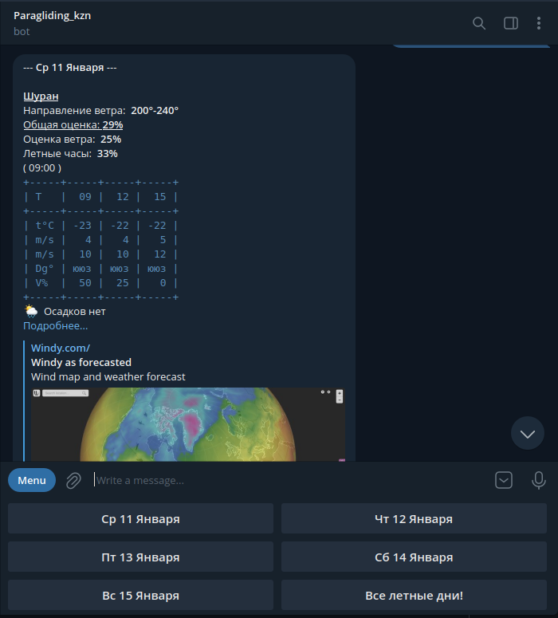
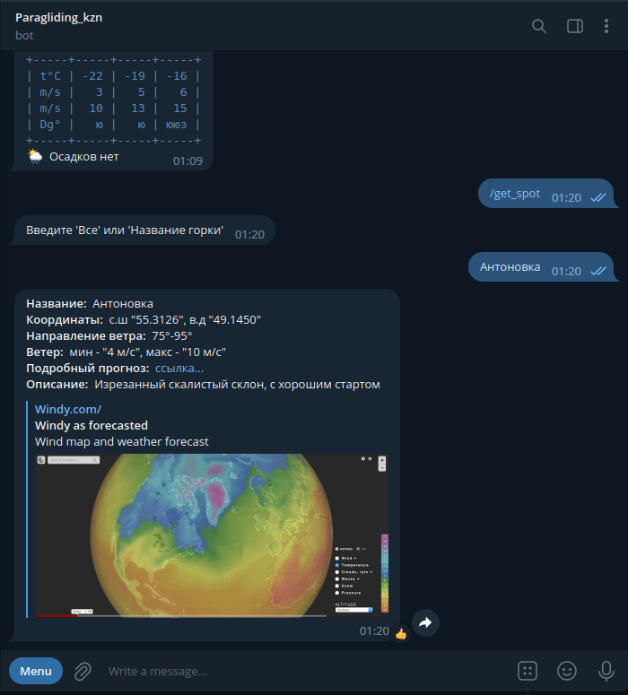

# para_kzn_bot
<b> Ссылка на бот: https://t.me/para_kzn_bot </b>

## Идея проекта:
Данный проект создан для парапланеристов из Казани.
Бот следит за прогнозам погоды и сообщает когда и где
можно полетать и с какой вероятностью.

## Стек технологий
1. `framework pyTelegramBotAPI`
2. `sqlite3` - хранение информации о пользователях и летных местах
3. `Cron` - запуск файлов на сервере
4. `Rest API` - получение актуального прогноза погоды

## Опписание проекта:

Раз в сутки `cron` запускает файл `meteo.py`,
который делает запрос через `Rest API` на сайт https://openweathermap.org/api
и записывает прогноз на 5 дней в `json` файл. Далее cron запускает
файл `remainder.py`, который анализирует прогноз из файла `json` и
отправляет всем пользователям из БД, у кого есть нужная отметка
, сформированный, красивый отчет о летных местах. Также пользователь может проверить в какой 
из дней летно с помощью кнопок снизу экрана.

    

Пользователь
может отказаться или возобновить рассылку с помощью команд `/stop`
, `/go` соответсвенно.
Данные комманды меняют отметку в БД
у этого пользователя. Пользователь с правами администратора может
добавлять, изменять или удалять летные места прямо из чата с ботом.
Данные о летных местах хроняться в БД.

    

## Интересные сложности
1. Придумать и написать алгоритм, который выбирает подходящий прогноз 
погоды, для полетов на параплане. Ничего подобного не нашел, поэтому все
написал сам в файле `get_meteo.py`.

2. Сформировать красивый и точный отчет о погоде, для формирования таблиц
использовал библиотеку `prettytable`.

3. Реализовать нопоминания о летной погоде. Долго искал лучшее решение и 
остановился на `cron`, а всю логику вывел в отдельный файл `reminder.py`.

4. Из чата с ботом добавлять, менять и изменять данные в БД. Для 
взаимодействия с БД пользовался `SQLlite3`. 

все зависимости в файле "requirements.txt" 
